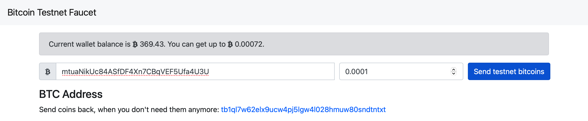
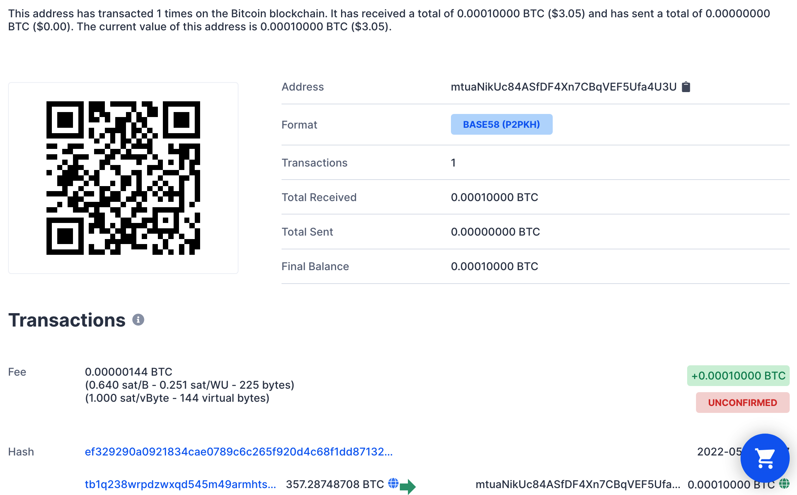
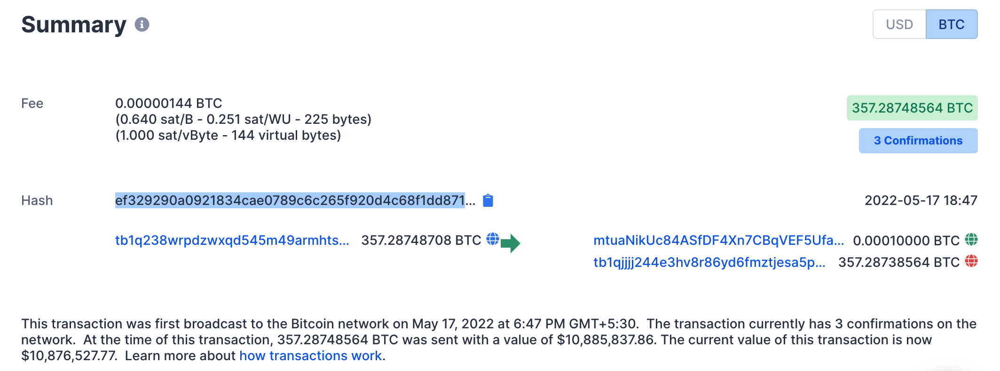

# Bitcoin

From scratch zero-dependency implementation of Bitcoin for educational purposes, including all of the under the hood crypto primitives such as SHA-256 and elliptic curves over finite fields math.

This repository provides a from scratch implementation of Bitcoin, more specifically the Bitcoin protocol. In this project, we build all the cypto primitive functions required for implementing the protocol. Primitive functions include SHA 256, Ripemd-160, Elliptical Cryptographic Curves.

After building all the necessary functions, we will create two unique wallet addresses using our own secret keys and execute a real transaction on the bitcoin test network.

## Generating Wallet Addresses

In this section we will see the procedure to generate a real bitcoin wallet address.

First up, we will initialize our elliptical curve parameters with the following values

```JavaScript
BigInteger p = new BigInteger("FFFFFFFFFFFFFFFFFFFFFFFFFFFFFFFFFFFFFFFFFFFFFFFFFFFFFFFEFFFFFC2F", 16);
BigInteger a = new BigInteger("0000000000000000000000000000000000000000000000000000000000000000", 16);
BigInteger b = new BigInteger("0000000000000000000000000000000000000000000000000000000000000007", 16);
BigInteger x = new BigInteger("79BE667EF9DCBBAC55A06295CE870B07029BFCDB2DCE28D959F2815B16F81798", 16);
BigInteger y = new BigInteger("483ada7726a3c4655da4fbfc0e1108a8fd17b448a68554199c47d08ffb10d4b8", 16);
BigInteger n = new BigInteger("FFFFFFFFFFFFFFFFFFFFFFFFFFFFFFFEBAAEDCE6AF48A03BBFD25E8CD0364141", 16);
```

These values are standard values that the bitcoin protocol uses to generate a new wallet address.

Now we will create Curve and Point classes. Curve class bascially initializes our ECC curve with the parameters a, b, and p. The point class defines the seed point on this ECC curve. All bitcoin wallet addresses start with this point.

```JavaScript
Curve bitcoinCurve = new Curve(p,a,b);
Point G = new Point(bitcoinCurve,x,y);
```

Our next step is to obtain a secret key from the user. The secret key will be used kind of like a password for generating the wallet address. The secret key will first be converted to integers. This integer will then be multiplied with the seed point `G` we defined above. This operation results in adding `G ` to itself `secret_key` number of times. The addition operation will be performed on the ECC curve and the result of the addition process is a new point on the curve with coordinates (x,y)

For simplicity, we will assume the `secret_key` to be `2`.

```JavaScript
int secret_key = 2;
Point pk = G.add(G);
```

If `secret_key` is `3` then,

```JavaScript
int secret_key = 3;
Point pk = G.add(G).add(G);
```

However this process becomes tedious when the secret_key is a very large value (which is usually the case in most real world secret keys). Hence to make this process easier, we will use additional algorithms that will make the process much faster.

```JavaScript
BigInteger secret_key = new BigInteger("1234567890");
Point pk = G.multiply(secret_key);
```

Note that any point obtained after multiplying the seed point with the secret key must lie on the curve defined by us. Otherwise this point cannot be used for generating wallet addresses.

To verify if our new point lies on the curve,

```JavaScript
System.out.println("Secret Key : "+secret_key);
System.out.println("Public Key : \nx : "+pk.x+"\ny : "+pk.y);
System.out.println("Public Key generated is on curve : \033[92m" + pk.verify_on_curve()+"\033[0m");
```

```bash
> Secret Key : 1234567890
  Public Key :
  x : 19635924277356798752105674083697999930996555344818160161847497917044432760610
  y : 21218882238660449272792211265489841951893738252848232230063147580786068364204
  Generated Point is on curve : true
```

Now lets generate a real bitcoin address by providing the secret key manually,

```JavaScript
String secret_key_string = "This is the bitcoin address of the first wallet.";
BigInteger secret_key = new BigInteger(toHex(secret_key_string), 16);
```

Printing the secret_key will result in the following output

```bash
> 12991558534057774220956985186119368258644532210348760637115131129936353298097675813900069943909894649963898250556462
```

Generating our wallet address and verifying if on curve.

```JavaScript
Point pk = G.multiply(secret_key);
System.out.println("Secret Key : "+secret_key_string);
System.out.println("Public Key : \nx : "+pk.x+"\ny : "+pk.y);
System.out.println("Public Key generated is on curve : \033[92m" + pk.verify_on_curve()+"\033[0m");
```

```bash
> Secret Key : This is the bitcoin address of the first wallet.
  Public Key :
  x : 29923686304727414546372867934731867300885153587267117101239909099742076575844
  y : 55225955892413022444173037737626668999635271360017664979805373003105507264653
  Public Key generated is on curve : true
```

```JavaScript
String wallet_address = PublicKey.toPublicKey(pk).address("test", true);
System.out.println("\nBitcoin addr : "+wallet_address);
System.out.println("Wallet Link : https://www.blockchain.com/btc-testnet/address/"+wallet_address);
```

```bash
> Bitcoin addr : mtuaNikUc84ASfDF4Xn7CBqVEF5Ufa4U3U
  Wallet Link : https://www.blockchain.com/btc-testnet/address/mtuaNikUc84ASfDF4Xn7CBqVEF5Ufa4U3U
```

We now have successfully generated our wallet address and the wallet is accessible in the link provided above. At the time of writing this, the wallet is completely clean. You may not find the same wallet to be clean in future as we will execute a transaction using this wallet.

Similarly, we will generate our second wallet address required for the transaction.

```JavaScript
String secret_key_string2 = "This is the bitcoin address of the second wallet.";
BigInteger secret_key2 = new BigInteger(toHex(secret_key_string2), 16);
Point pk2 = G.multiply(secret_key2);
String wallet_address2 = PublicKey.toPublicKey(pk2).address("test", true);
System.out.println("\nBitcoin addr : "+wallet_address2);
System.out.println("Wallet Link : https://www.blockchain.com/btc-testnet/address/"+wallet_address2);
```

```bash
> Bitcoin addr : mtPUdKsCLdtfknqpmS1PKzYVXg2XHPXfMA
  Wallet Link : https://www.blockchain.com/btc-testnet/address/mtPUdKsCLdtfknqpmS1PKzYVXg2XHPXfMA
```

Wallet Addresses

```JavaScript
Wallet 1 Address : mtuaNikUc84ASfDF4Xn7CBqVEF5Ufa4U3U
Wallet 2 Address : mtPUdKsCLdtfknqpmS1PKzYVXg2XHPXfMA
```

Now it's time to deposit some bitcoins in our wallet. Normally this would mean logging into a Crypto brokerage and depositing some money and then buying bitcoins from that. That only works on the main network. Since we are using a testnet, we need to ask bitcoin faucets to fund some bitcoins to our wallet. There are many bitcoin faucets available. In this I will be using the following [bitcoin faucet](https://bitcoinfaucet.uo1.net).

In the bitcoin faucet website please type in the wallet 1 address. This will transfer some 'x' amounts of bitcoin to your first wallet. Here I am transferring 0.0001 BTC to Wallet 1.

&nbsp;

<p align="center">
   </img>
</p>

Now visiting our wallet 1's link, we can see that we have successfully received the bitcoins from the testnet faucet. Please wait until the transaction gets confirmed by the blockchain. This usually takes 2 - 15 minutes depending on when you are executing the transaction. 

&nbsp;

<p align="center">
   </img>
</p>

Now we are ready to craft our very own bitcoin transaction where we will be sending some amount of money from Wallet 1 to Wallet 2 on the bitcoin testnet.

Before we proceed, please visit your wallet 1 and make note of the latest transaction's hash. (Make sure you click the copy button to copy the complete hash.)

&nbsp;

<p align="center">
   </img>
</p>

We will need that hash string when we are creating our transaction. Basically, for a transaction to execute properly, we need to provide a proof for the source of funds in a wallet. And the hash we just copied does exactly that. It specifies the amount of money transfered from which source wallet to which destination wallet.

In this tutorial, the previous transaction hash is given below.

```bash
> ef329290a0921834cae0789c6c265f920d4c68f1dd87132dc36448042d1901a5
```

Now we begin crafting our transaction.

Begin by creating the transaction in TxIn script. 

```JavaScript
// paste previous transaction hash here.
BigInteger transaction_id = new BigInteger("ef329290a0921834cae0789c6c265f920d4c68f1dd87132dc36448042d1901a5", 16);
TxIn tx_in = new TxIn(transaction_id.toByteArray(), 1, null, "test");
```

Now we encode our wallet2's address

```JavaScript
byte[] out1_pkb_hash = PublicKey.toPublicKey(pk2).encode(true, true);
ArrayList<Object> t = new ArrayList<Object>();
ArrayList<ArrayList<Object>> temp = new  ArrayList<ArrayList<Object>>();
t.add(118);
temp.add(t);
t = new ArrayList<Object>();
t.add(169);
temp.add(t);
t = new ArrayList<Object>();
for(byte by : out1_pkb_hash){
    t.add((byte)by);
}
temp.add(t);
t = new ArrayList<Object>();
t.add(136);
temp.add(t);
t = new ArrayList<Object>();
t.add(172);
temp.add(t);

Script out1_script = new Script(temp);
System.out.println("out1_script : "+bytesToHex(out1_script.encode()));
```

```bash
> out1_script : 1976a9148d2fa0aaafa219ec9e24264fc3221dcc18b917b488ac
```

Encoding our first wallet and creating the script.

```JavaScript
byte[] out2_pkb_hash = PublicKey.toPublicKey(pk).encode(true, true);
ArrayList<Object> t2 = new ArrayList<Object>();
ArrayList<ArrayList<Object>> temp2 = new  ArrayList<ArrayList<Object>>();
t2.add(118);
temp2.add(t2);
t2 = new ArrayList<Object>();
t2.add(169);
temp2.add(t2);
t2 = new ArrayList<Object>();
for(byte by : out2_pkb_hash){
    t2.add((byte)by);
}
temp2.add(t2);
t2 = new ArrayList<Object>();
t2.add(136);
temp2.add(t2);
t2 = new ArrayList<Object>();
t2.add(172);
temp2.add(t2);
Script out2_script = new Script(temp2);
System.out.println("out2_script : "+bytesToHex(out2_script.encode()));
```

```bash
> out2_script : 1976a91492e0e7a0e502903d8e696b8ee9bf2febbb05626688ac
```

Using the above scripts, we will create TxOut Scripts. Here we will specify the the amount of money to send to the second wallet. The amount here is entered as satoshi (1 BTC = 1e8 satoshis). Here we are transferring 100 satoshis to our second wallet. There is a second part to this. One amount is sent to the second wallet and we need to resend the same amount back to ourselves. However here we also need to take into account of the miner fee. This fee is called the gas fees which will be collected by the miner to insert our block of transaction onto the blockchain. The fee to the miner must be set according to the market rate. Here for demonstrations, we will keep the fee as 30 satoshis. Hence we will send back 70 satoshis to our source wallet.

```JavaScript
TxOut tx_out1 = new TxOut(100, out1_script); // enter amount to send here.
TxOut tx_out2 = new TxOut(70, out2_script); // enter amount - gas fee here.

ArrayList<TxOut> out_scripts = new ArrayList<TxOut>();
out_scripts.add(tx_out1);
out_scripts.add(tx_out2);

ArrayList<TxIn> tx_in_scripts = new ArrayList<TxIn>();
tx_in_scripts.add(tx_in);
```

Encapsulating the TxIn and TxOut scripts in a Tx (Transaction Class).

```JavaScript
Tx tx = new Tx(1, tx_in_scripts, out_scripts);
ArrayList<Object> t3 = new ArrayList<Object>();
ArrayList<ArrayList<Object>> temp3 = new  ArrayList<ArrayList<Object>>();
t3.add(118);
temp3.add(t3);
t3 = new ArrayList<Object>();
t3.add(169);
temp3.add(t3);
t3 = new ArrayList<Object>();
for(byte by : out2_pkb_hash){
    t3.add((byte)by);
}
temp3.add(t3);
t3 = new ArrayList<Object>();
t3.add(136);
temp3.add(t3);
t3 = new ArrayList<Object>();
t3.add(172);
temp3.add(t3);

Script source_script = new Script(temp3);
tx_in.setPrevScript(source_script);
```

Displaying our Transaction message

```JavaScript
byte[] message = tx.encode(0);
System.out.println("\nmessage : "+bytesToHex(message));
```

```bash
> message : 0100000001a501192d044864c32d1387ddf1684c0d925f266c9c78e0ca341892a0909232ef010000001976a91492e0e7a0e502903d8e696b8ee9bf2febbb05626688acffffffff0264000000000000001976a9148d2fa0aaafa219ec9e24264fc3221dcc18b917b488ac46000000000000001976a91492e0e7a0e502903d8e696b8ee9bf2febbb05626688ac0000000001000000
```

We are still not done. We have just encoded our transaction script. For this to be accepted by blockchain, we need to digitally sign this using our secret_key of our first wallet (important!). This is because we are sending money from wallet 1 to wallet 2. If we send money other way, we need to just swap it with secret_key2.

```JavaScript
Signature sig = new Signature();
sig = sig.sign(secret_key, message);
System.out.println("\nSignature : \n" + sig);
```

```bash
> Signature :
r: 89565891926547004231252920425935692360644145829622209833684329913297188986597 s: 21014402145590674004050343037082224195543335789714313265099166768005020514658
```

Attaching this signature to our scripts

```JavaScript
byte[] sig_bytes = sig.encode();
byte [] sig_bytes_and_type = new byte[sig_bytes.length+1];
int i = 0;
for(i = 0; i<sig_bytes.length; i++){
  sig_bytes_and_type[i] = sig_bytes[i];
}
sig_bytes_and_type[i] = (byte)0x01;

byte[] pubkey_bytes = PublicKey.toPublicKey(pk).encode(true, false);

ArrayList<ArrayList<Object>> par = new ArrayList<ArrayList<Object>>();
t3 = new ArrayList<Object>();
for(byte sbt : sig_bytes_and_type){
  t3.add(sbt);
}
par.add(t3);
t3 = new ArrayList<Object>();
for(byte sbt : pubkey_bytes){
  t3.add(sbt);
}
par.add(t3);

Script script_sig = new Script(par);
tx_in.setScript(script_sig);
```

That's it. We have finally setup everything needed to execute our transaction. We just have to display our transaction hash and execute it on the blockchain.

```JavaScript
System.out.println(bytesToHex(tx.encode(-1)));
```

```bash
> 0100000001a501192d044864c32d1387ddf1684c0d925f266c9c78e0ca341892a0909232ef010000006b483045022100c6047f9441ed7d6d3045406e95c07cd85c778e4b8cef3ca7abac09b95c709ee502202e75bae8ea18a810bf59ea02d94d1787d48cd2ca26c338d0b2d4a7d14b71f962012103422834cced67633c3164a5e9b1db6beeb00fb0bd231ba5ac9e7a8bbb805ba064ffffffff0264000000000000001976a9148d2fa0aaafa219ec9e24264fc3221dcc18b917b488ac46000000000000001976a91492e0e7a0e502903d8e696b8ee9bf2febbb05626688ac00000000
```

Displaying the expected transaction ID once the transaction gets executed on the blockchain.

```JavaScript
System.out.println("ID : "+tx.id());
```

```bash
> ID : aa47b32d15e4287b71bd61c312b2ebf93254d4bf5c2dbfff5911c948ccee0d19
```

Now take the big transaction hash generated above and upload [here]() to broadcast the transaction in the testnet. 

## Build

Install maven on your systems. 

On macOS, if you have brew installed please type the following command in terminal

```bash
brew install maven
```

Go into project directory and type the following command to build the project

```bash
mvn package
```

## Run the Code

To execute the bitcoin code, execute the following command in terminal

```bash
java -jar target/bitcoin-0.1.0.jar
```
